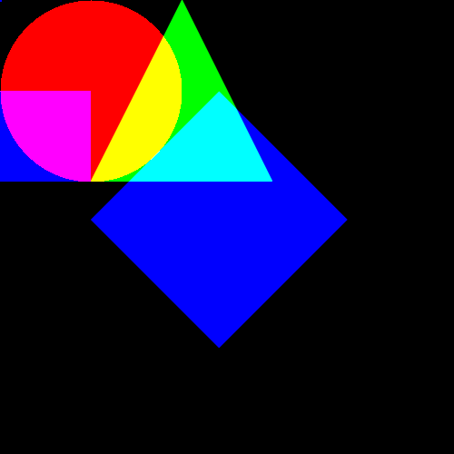

# CPPND: Capstone Project

## Shape drawing console application in C++ with OpenCV

## Overview
This is the capstone project for the [Udacity C++ Nanodegree Program](https://www.udacity.com/course/c-plus-plus-nanodegree--nd213). This Shape Drawing Program is a C++ console application that allows users to create, manipulate, and draw various shapes, including circles, triangles, and rectangles, on a canvas. **Here, the canvas should be black or other dark colors, as we use additive color models to display the colors**. we add Users can modify shapes by translating, rotating, scaling, and changing colors. The program provides an intuitive menu interface for these actions and allows users to display and save the drawn images. It uses opencv library to create different shape, draw and transform them.

## File Structure

This repository contains:

- `src/` : Source. Constains the `main.cpp` file.

- `CMakeLists.txt` : cmake configuration file

- `README.md` : This file

## Dependencies for Running Locally
* cmake >= 3.11.3
  * All OSes: [click here for installation instructions](https://cmake.org/install/)
* make >= 4.1 (Linux, Mac), 3.81 (Windows)
  * Linux: make is installed by default on most Linux distros
  * Mac: [install Xcode command line tools to get make](https://developer.apple.com/xcode/features/)
  * Windows: [Click here for installation instructions](http://gnuwin32.sourceforge.net/packages/make.htm)
* OpenCV >= 4.3.x
  * The OpenCV 4.3.0 source code can be found [here](https://github.com/opencv/opencv/master)
* gcc/g++ >= 5.4
  * Linux: gcc / g++ is installed by default on most Linux distros
  * Mac: same deal as make - [install Xcode command line tools](https://developer.apple.com/xcode/features/)
  * Windows: recommend using [MinGW](http://www.mingw.org/)

  **! This repository has been successfully built and tested on Ubuntu 18.08 with OpenCV 4.3 running C++17.**

## Build Instructions

1. Clone this repo using `git clone https://github.com/avnishsachar/CppND-Program-Capstone-Project.git`
2. Enter the root directory of the repository using `cd CppND-Capstone`
3. `mkdir build && cd build`
4. `cmake ..`
5. `make`

The executable(`Capstone`) is created in the current directory(`build`).

## Run

In `build` directory, run the executable like below:

`./Capstone`

This program allows us to create and manipulate various shapes, including circles, triangles, and rectangles, and then draw them on a canvas. We can modify these shapes by translating, rotating, scaling, and changing their colors.

### Menu Options
The program offers the following menu options:

#### 1. Create Circle
Allows you to create a circle by specifying its radius.
You will be prompted to enter the radius.
#### 2. Create Triangle
Allows you to create a triangle by specifying its base and height.
You will be prompted to enter the base length and height.
#### 3. Create Rectangle
Allows you to create a rectangle by specifying its width and height.
You will be prompted to enter the width and height.
#### 4. Modify Shape
Lets you modify an existing shape.
Choose a shape from the list and select a modification option:
Translate: Move the shape.
Rotate: Rotate the shape by a specified angle.
Scale: Change the size of the shape.
Change Color: Modify the shape's color.
#### 5. Show Image
Displays the drawing of all shapes on a canvas.
You will be asked to specify the canvas size and color.
The canvas will be shown in a window.
#### 6. Save Image
Saves the drawing of all shapes on a canvas as an image file.
You will need to specify the canvas size, color, and the image path.
The image will be saved in the specified location.
#### 7. Exit
Closes the program.
### Creating Shapes
#### Circle
To create a circle, choose "Create Circle" from the menu.
Enter the radius of the circle when prompted.
#### Triangle
To create a triangle, choose "Create Triangle" from the menu.
Enter the base length and height of the triangle when prompted.
#### Rectangle
To create a rectangle, choose "Create Rectangle" from the menu.
Enter the width and height of the rectangle when prompted.
### Modifying Shapes
#### Translate
Select "Modify Shape" from the menu.
Choose the shape you want to modify.
Select "Translate" and enter the translation in the X and Y directions.
#### Rotate
Select "Modify Shape" from the menu.
Choose the shape you want to modify.
Select "Rotate" and enter the rotation angle in degrees.
#### Scale
Select "Modify Shape" from the menu.
Choose the shape you want to modify.
Select "Scale" and enter the scaling factor.
#### Change Color
Select "Modify Shape" from the menu.
Choose the shape you want to modify.
Select "Change Color" and enter the new color in RGB format (e.g., "255 0 0" for red).
### Displaying and Saving Images
#### Show Image
Select "Show Image" from the menu.
Specify the canvas size and color when prompted.
The canvas with all shapes will be displayed in a window.
#### Save Image
Select "Save Image" from the menu.
Specify the canvas size, color, and the image path when prompted. The canvas with all shapes will be saved as an image in the specified location. The image path should also contain the the extension of the image type. An example image path would be `/home/workspace/my_drawing.png`.

### Exiting the Program
To exit the program, choose "Exit" from the menu.
That's it! We are now ready to create, modify, and draw various shapes using the Shape Drawing Program.

## Rubric

__README (All Rubric Points REQUIRED)__

|DONE | CRITERIA | MEETS SPECIFICATIONS| WHERE |
|-- | -- | --| -- |
| :heavy_check_mark: | A README with instructions is included with the project |The README is included with the project and has instructions for building/running the project. If any additional libraries are needed to run the project, these are indicated with cross-platform installation instructions. You can submit your writeup as markdown or pdf.| |
| :heavy_check_mark: | The README indicates which project is chosen. | The README describes the project you have built. The README also indicates the file and class structure, along with the expected behavior or output of the program. | |
| :heavy_check_mark: | The README includes information about each rubric point addressed. | The README indicates which rubric points are addressed. The README also indicates where in the code (i.e. files and line numbers) that the rubric points are addressed. | |

__Compiling and Testing (All Rubric Points REQUIRED)__

|DONE | CRITERIA | MEETS SPECIFICATIONS| WHERE |
|-- | -- | --| -- |
| :heavy_check_mark: | The submission must compile and run. | The project code must compile and run without errors. We strongly recommend using cmake and make, as provided in the starter repos. If you choose another build system, the code must compile on any reviewer platform. |

__Loops, Functions, I/O__

|DONE | CRITERIA | MEETS SPECIFICATIONS| WHERE |
|-- | -- | --| -- |
| :heavy_check_mark: | The project demonstrates an understanding of C++ functions and control structures.| A variety of control structures are used in the project. The project code is clearly organized into functions.| main.cpp file |
| :heavy_check_mark: | The project reads data from a file and process the data, or the program writes data to a file. | The project reads data from an external file or writes data to a file as part of the necessary operation of the program.| The program saves the drawing as an image https://github.com/raisulzaeem/CppND-Capstone/blob/fb69891e9904ea0d42720036b7356ad78e6e0829/src/main.cpp#L444  |
| :heavy_check_mark: | The project accepts user input and processes the input.|The project accepts input from a user as part of the necessary operation of the program.|  The programm is a console application and continuously accepts and processes user inputs |

__Object Oriented Programming__

|DONE | CRITERIA | MEETS SPECIFICATIONS| WHERE |
|-- | -- | --| -- |
| :heavy_check_mark: | The project uses Object Oriented Programming techniques. | The project code is organized into classes with class attributes to hold the data, and class methods to perform tasks. | Shape Class in main.cpp https://github.com/raisulzaeem/CppND-Capstone/blob/09c79699380d79932b94ed5904e4b1b9683a3301/src/main.cpp#L29|
| :heavy_check_mark: | Classes use appropriate access specifiers for class members. | All class data members are explicitly specified as public, protected, or private.| Shape Class in main.cpp https://github.com/raisulzaeem/CppND-Capstone/blob/09c79699380d79932b94ed5904e4b1b9683a3301/src/main.cpp#L30|
| :heavy_check_mark: | Class constructors utilize member initialization lists. | All class members that are set to argument values are initialized through member initialization lists.| Point_ Class https://github.com/raisulzaeem/CppND-Capstone/blob/09c79699380d79932b94ed5904e4b1b9683a3301/src/main.cpp#L23 , Shape Class https://github.com/raisulzaeem/CppND-Capstone/blob/09c79699380d79932b94ed5904e4b1b9683a3301/src/main.cpp#L34, Color Struct |
| :heavy_check_mark: | Classes abstract implementation details from their interfaces. | All class member functions document their effects, either through function names, comments, or formal documentation. Member functions do not change program state in undocumented ways.| Shape Abtract Class https://github.com/raisulzaeem/CppND-Capstone/blob/09c79699380d79932b94ed5904e4b1b9683a3301/src/main.cpp#L29 |
| :heavy_check_mark: | Classes encapsulate behavior. | Appropriate data and functions are grouped into classes. Member data that is subject to an invariant is hidden from the user. State is accessed via member functions.| In Shape class, the variables center, height_, width_, angle_ https://github.com/raisulzaeem/CppND-Capstone/blob/09c79699380d79932b94ed5904e4b1b9683a3301/src/main.cpp#L136|
| :heavy_check_mark: | Classes follow an appropriate inheritance hierarchy. | Inheritance hierarchies are logical. Composition is used instead of inheritance when appropriate. Abstract classes are composed of pure virtual functions. Override functions are specified.| Rectangle, Circle, Triangle classes are inherited classes from the abstract Shape Class https://github.com/raisulzaeem/CppND-Capstone/blob/09c79699380d79932b94ed5904e4b1b9683a3301/src/main.cpp#L146 |
| :heavy_check_mark: | Overloaded functions allow the same function to operate on different parameters. | Different Constructors for Rectangle, Triangle class.  |
| :heavy_check_mark: | Derived class functions override virtual base class functions. |One member function in an inherited class overrides a virtual base class member function.| the draw(https://github.com/raisulzaeem/CppND-Capstone/blob/09c79699380d79932b94ed5904e4b1b9683a3301/src/main.cpp#L121) and getArea() function in Base Shape class and Inherited Rectangle, Circle and Triangle class. |
|| Templates generalize functions in the project. | One function is declared with a template that allows it to accept a generic parameter.||

__Memory Management__

|DONE | CRITERIA | MEETS SPECIFICATIONS| WHERE |
|-- | -- | --| -- |
| :heavy_check_mark: | The project makes use of references in function declarations. | At least two variables are defined as references, or two functions use pass-by-reference in the project code.|Copy Constructor and Copy Assignment Operator|
|| The project uses destructors appropriately. | At least one class that uses unmanaged dynamically allocated memory, along with any class that otherwise needs to modify state upon the termination of an object, uses a destructor. | |
|| The project uses scope / Resource Acquisition Is Initialization (RAII) where appropriate. | The project follows the Resource Acquisition Is Initialization pattern where appropriate, by allocating objects at compile-time, initializing objects when they are declared, and utilizing scope to ensure their automatic destruction.| |
| :heavy_check_mark: | The project follows the Rule of 5. | For all classes, if any one of the copy constructor, copy assignment operator, move constructor, move assignment operator, and destructor are defined, then all of these functions are defined.| Done in Shape Base class |
| :heavy_check_mark: | The project uses move semantics to move data, instead of copying it, where possible. | For classes with move constructors, the project returns objects of that class by value, and relies on the move constructor, instead of copying the object. | Done in move constructor and move assignment operator  |
| :heavy_check_mark: | The project uses smart pointers instead of raw pointers. | The project uses at least one smart pointer: unique_ptr, shared_ptr, or weak_ptr. The project does not use raw pointers.| The variable center https://github.com/raisulzaeem/CppND-Capstone/blob/09c79699380d79932b94ed5904e4b1b9683a3301/src/main.cpp#L139 in Shape class in main.cpp |

__Concurrency__

|DONE | CRITERIA | MEETS SPECIFICATIONS| WHERE |
|-- | -- | --| -- |
| | The project uses multithreading. | The project uses multiple threads in the execution.| |
|  | A promise and future is used in the project. | A promise and future is used to pass data from a worker thread to a parent thread in the project code.| |
|| A mutex or lock is used in the project. | A mutex or lock (e.g. std::lock_guard or `std::unique_lock) is used to protect data that is shared across multiple threads in the project code.||
|  | A condition variable is used in the project. | A std::condition_variable is used in the project code to synchronize thread execution.| |
